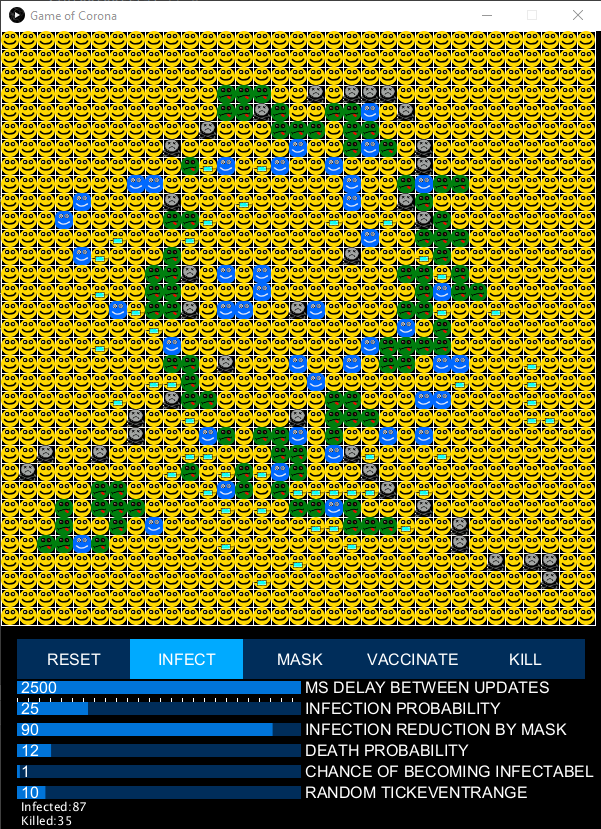
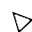
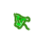
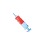

Game of Corona
---
Eine primtive Virussimulation.

## Kurzbschreibung:

„Game of Corona“ ist eine Abwandlung des Klassikers „Game of Life“. Der User kann einzelne Zellen „infizieren“ und benachbarte Zellen können sich anders als beim Original „Game of Life“ anhand eines Zufallswertes anstecken. Zellen mit Maske können eine geringere Ansteckungswahrscheinlichkeit haben. Die Zellen können nach einer Infektion sterben oder immun werden. Der User soll die Simulation beeinflussen können, indem er Zellen infiziert, impft, Masken tragen lässt oder tötet. Darüber hinaus können die Geschwindigkeit und Wahrscheinlichkeiten wie die Infektionswahrscheinlichkeit für eine Zelle die mit einer kranken Zelle benachbart ist, wie stark die Infektionswahrscheinlichkeit abnimmt, wenn eine Zelle eine Maske trägt, die Tödlichkeit des Virus und Chance nach einer Immunisierung erneut infiziert zu werden, eingestellt werden. Zusätzlich lassen sich die „ticks till event“ einstellen hiervon wird die Dauer einer Infektion und die Dauer der Immunität beeinflusst.

## Legende zu den Zellen Icons

| Zellen Icon | Zustand | Kurzbeschreibung |
| ------ | ------ | ------ |
|  | gesund | Eine gesunde Zelle, sie kann infiziert, maskiert, geimpft und getötet werden. |
|  | maskiert | Eine maskierte Zelle, sie hat ein geringeres Infektionsrisko, verhält sich ansonsten wie eine gesunde Zelle.|
|   | immun | Eine immune Zelle, kann nicht Krank werden und auch keine Maske tragen, Spieler kann sie dennoch töten.|
|  | krank | Eine kranke Zelle steckt ihre nachbarn an, hat die möglichkeit zu sterben oder immun zuwerden.|
|  | tot | Eine tote Zelle kann nichts mehr machen und kann nur durch ein reset wiederbelebt werden.|

## Die Buttons
Mit klicken auf die Buttons können die folgenden Aktionen durchgeführt werden:

| Button | Beschreibung | Mouseicon |
| ------ | ------ | ------ |
| reset | Reset setzt alle Zellen gesund, ihre ticksTillEvent auf 0 und den Mausmodus auf default. Die Statistiken werden genullt.|  |
| infect | Die Maus wird in einen "Infectmodus" versetzt, jetzt kann durch klicken auf eine Zelle diese infiziert werden. |  |
| mask | Die Maus wird in einen "Maskiermodus" versetzt, jetzt kann durch klicken auf eine Zelle diese maskiert werden. |  |
| vaccinate | Die Maus wird in einen "Impfmodus" versetzt, jetzt kann durch klicken auf eine Zelle diese geimpft werden. |  |
| kill | Die Maus wird in einen "Tötungsmodus" versetzt, jetzt kann durch klicken auf eine Zelle diese getötet werden. |  |

## Erklärung für die Slider
Die werte der Slider können wahlweise über klick auf eine Position im Slider oder durch benutzen des Mausrades verändert werden.
| Titel | Beschreibung | von | bis | in |
| ------ | ------ | ------ | ------ | ------ |
| ms delay between updates | Die Zeit zwischen den Updates "Ticks" des Boards. | 0 | 2500 | Millisekunden |
| infection probability | Die Wahrscheinlichkeiten für jede Nachbarzelle einer infizierten Zell beim nächsten Update infiziert zu werden. | 0 | 100 | % |
| infection reduction by mask | Wie stark eine Maske die Infektionswahrscheinlichkeit verringert. | 0 | 100 | % |
| death probability | Die Wahrscheinlichkeiten das eine Zelle nach ein Infektion stirbt. | 0 | 100 | % |
| chance of becoming infectabel| Die Wahrscheinlichkeiten das eine Zell nach einer Immunisierung erneut angesteckt werden kann. Nach ablauf der mindest Immunzeit wird jede runde erneut gewürfelt. | 0 | 100 | % |
| random tickeventrange | Die Tickrange bestimmt wie lange eine Zelle maximal Krank sein kann, der wert x5 bestimmt die maximale mindest Immunzeit der Zelle. | 0 | 100 | game ticks |
